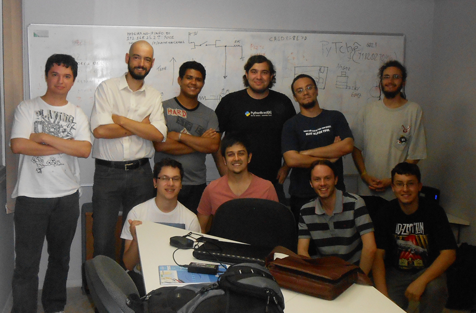
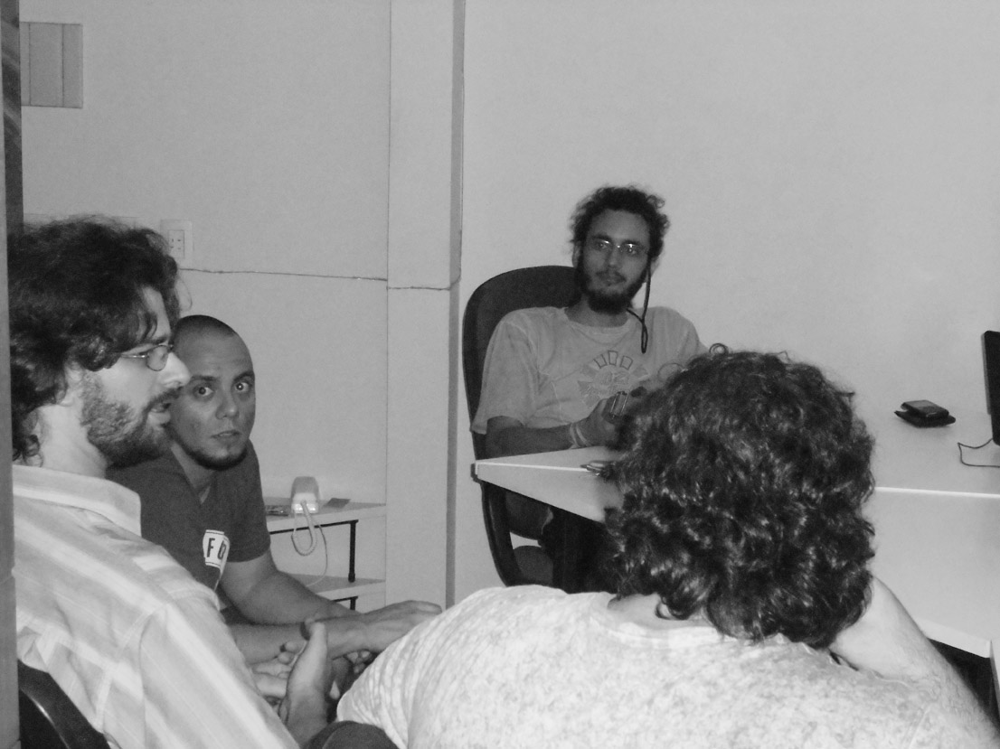
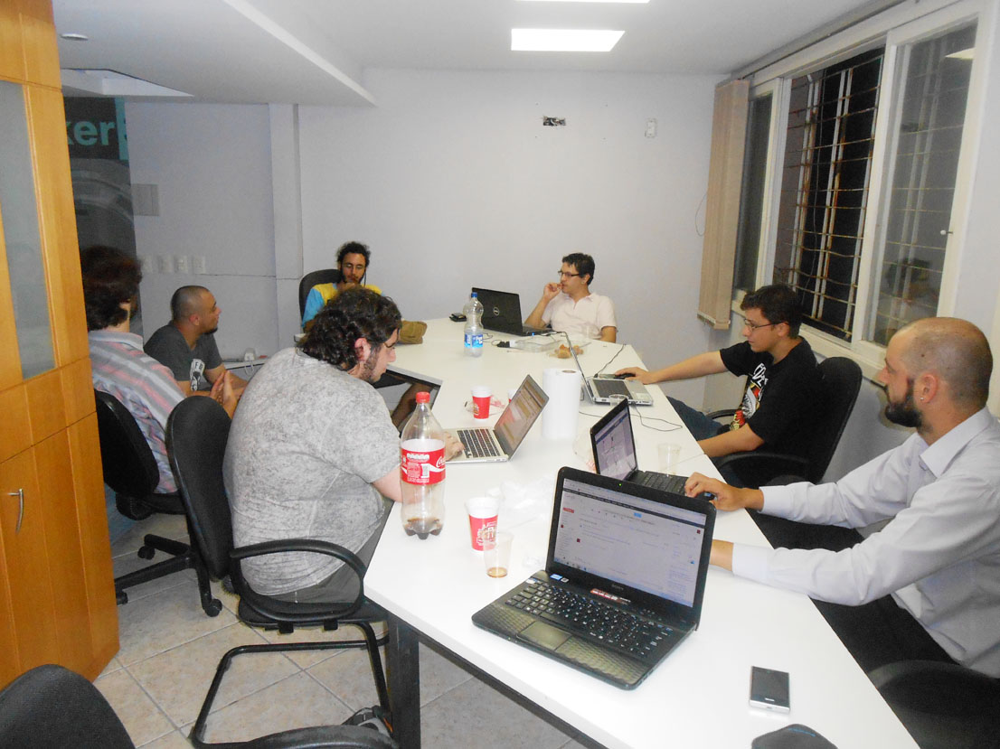
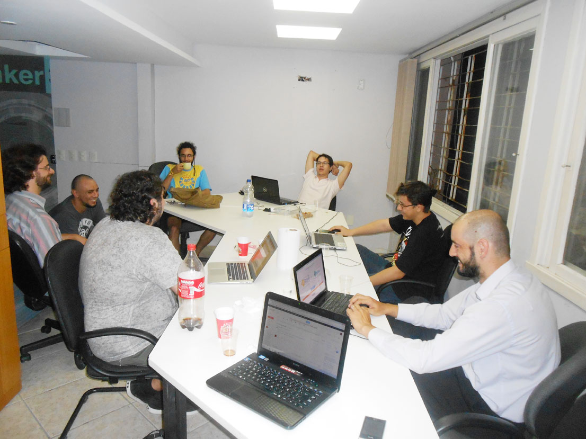

Encontros realizados
==================================================
Nesta seção você encontrará informações sobre os encontros realizados pelo PyTche.

Primeiro Encontro (13/12/2012) - Matehackers
--------------------------------------------------
O primeiro encontro do grupo foi realizado no hackerspace do Matehackers no Bunker360 em Porto Alegre/RS. Neste dia foram discutidos a criação da lista de discussão, atividades que o grupo poderá criar para incentivar o uso da linguagem Python no RS dentre outros assuntos.

    Foto tirada no primeiro encontro do grupo no Matehackers (Créditos: Vagner).

Dojo (20/12/2012) - Matehackers
--------------------------------------------------
Encontro realizado no hackerspace do Matehackers no Bunker360 em Porto Alegre/RS.

    